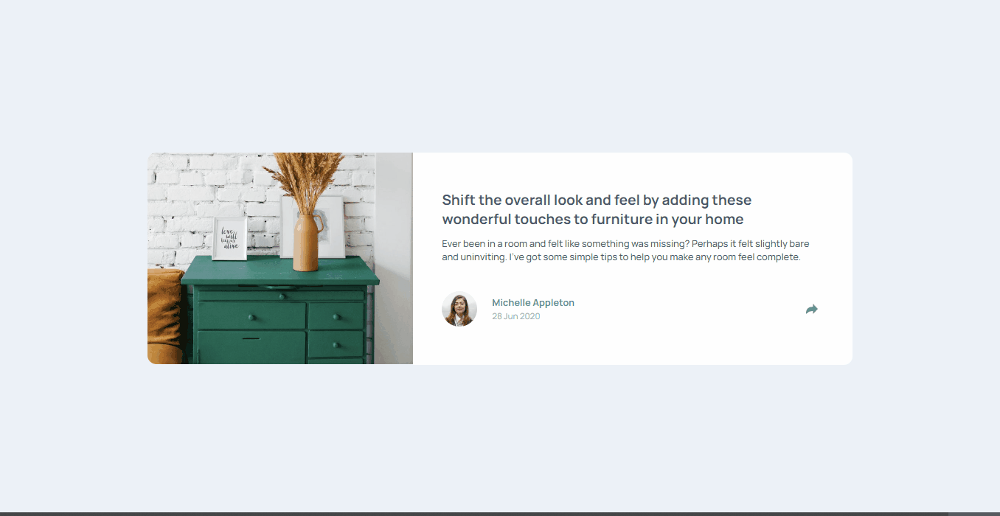
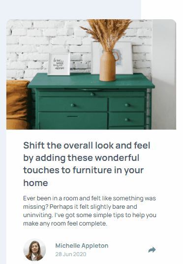

# Desafio Preview de Artigo com Compartilhamento - Frontend-Mentor

Este é um desafio de preview de artigo com compartilhamento proposto pelo site Frontend-Mentor.

## Tabela de Conteúdos

- [Visão Geral](#visão-geral)
    - [Imagens](#imagens)
    - [Link da página](#link)
- [Processo](#processo)
    - [Linguagens utilizadas](#linguagens-utilizadas)
    - [O que aprendi](#o-que-aprendi)
    - [Possíveis evoluções](#possíveis-evoluções)
- [Autor](#autor)

## Visão-geral

### Imagens

<br>

````
Versão de Desktop
````

   

<br>

````
Versão Mobile
````

 

### Link

- Página no GitHub Pages: <a href="https://julio-mansan2.github.io/preview-artigo-com-compartilhamento/">Clique aqui!</a>

## Processo

### Linguagens utilizadas

<br>

- Marcações semânticas de HTML5
- Propriedades de customização do CSS3
- Estruturas de JavaScript

<br>

### O que aprendi

<br>

- Criar um balão com CSS:

````html

<div id="balao" class="balao">
    <p>S H A R E</p>
    <a href="https://www.facebook.com/">
        <i class="fab fa-2x fa-facebook-square"></i>
    </a>
    <a href="https://twitter.com/">
        <i class="fab fa-2x fa-twitter"></i>
    </a>
    <a href="https://br.pinterest.com">
        <i class="fab fa-2x fa-pinterest"></i>
    </a>
</div>

````

````css

.balao {
    margin: 0 auto; 
    background: var(--very-dark-grayish-blue);
    border-radius: 15px;
    display: none;
    justify-content: center;
    gap: 30px;
    align-items: center;
    height: auto;
    color: var(--white);
    padding: 1.25rem;
    position: absolute;
    transition: 0.3s;
    right: -6%;
    top: 45%;
}

.balao::after {
    content: "";
    width: 0;
    height: 0;
    position: absolute;
    border-left: 20px solid transparent;
    border-right: 20px solid transparent;
    border-top: 20px solid var(--very-dark-grayish-blue);
    bottom: -1.25rem;
    left: 45%;
}

````

- Mostrar uma caixa de texto após o clique de um botão:

````html

<button id="btn"></button>


````

````javascript

const btnShare = document.getElementById('btn')
const btnImage = document.getElementById('btn-image')
const balao = document.getElementById('balao')

btnShare.addEventListener('click', function () {
    balao.classList.toggle('aparecer')
    btnShare.classList.toggle('bg-active')
    btnImage.classList.toggle('seta-branca')
})

````

<br>

### Possíveis evoluções

<br>

- Códigos mais compactos;
- Posicionar melhor os elementos em "position: absolute".

<br>

## Autor

GitHub - <a href="https://github.com/julio-mansan2">julio-mansan2</a> <br>
Front-end Mentor - <a href="https://www.frontendmentor.io/profile/julio-mansan2">julio-mansan2</a> <br>
LinkedIn - <a href="https://www.linkedin.com/in/j%C3%BAlio-a-mansan-3415a7249/">Júlio A. Mansan</a> <br>